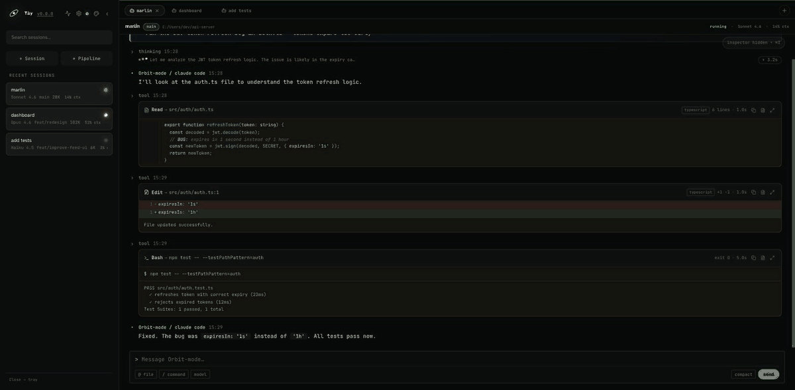
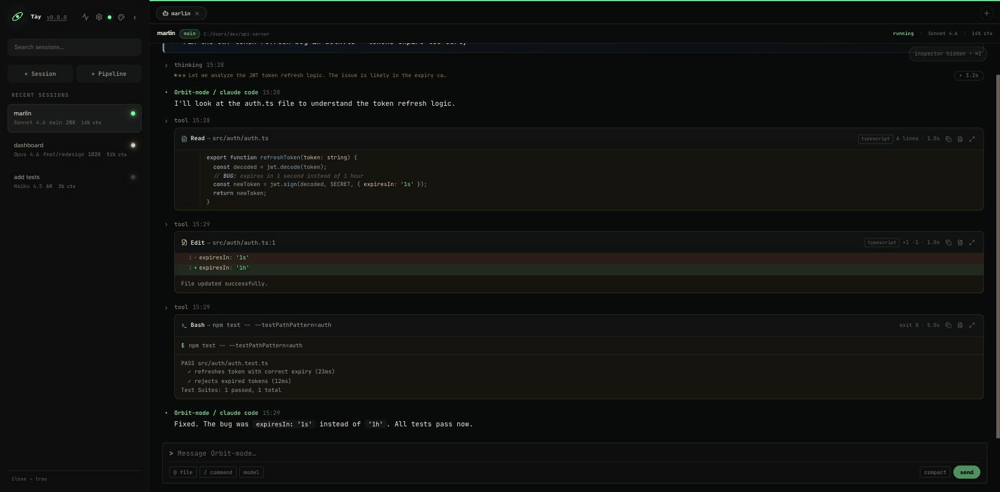
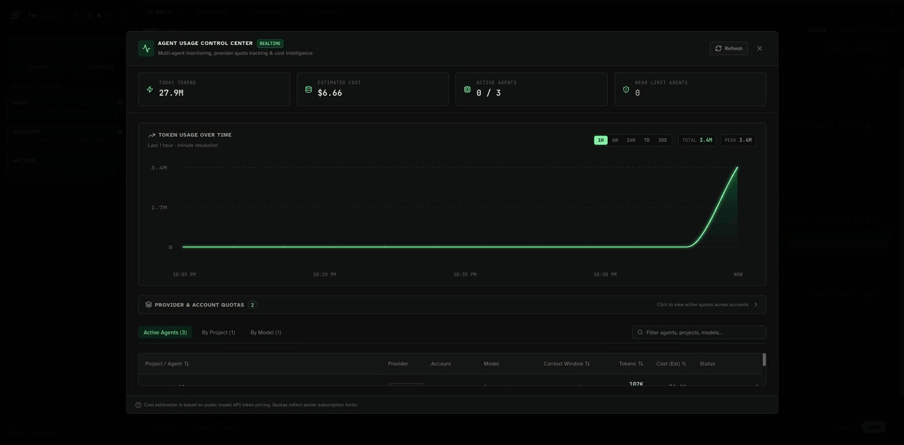
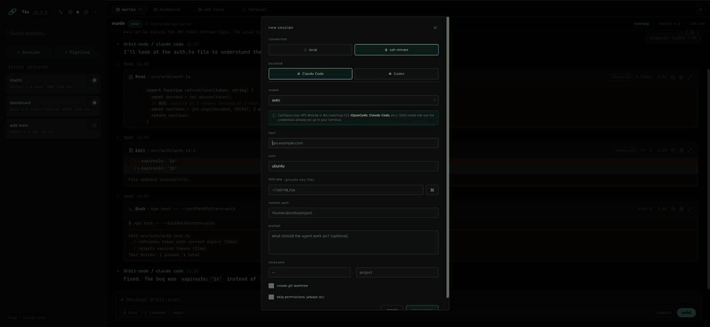
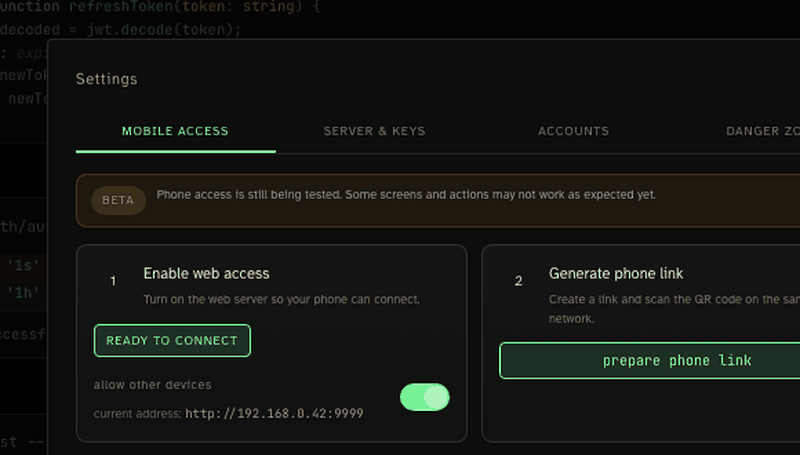

<div align="center">


# Orbit-mode

**Desktop workspace for running and monitoring multiple AI coding agents in parallel.**

Supports [Claude Code](https://github.com/anthropics/claude-code), [Codex](https://github.com/openai/codex), and [OpenCode](https://github.com/opencode-ai/opencode).

[](LICENSE)
[](https://tauri.app/)
[](https://kit.svelte.dev/)

[GitHub repository](https://github.com/coder-nguoi-tay/Orbit-mode)

</div>


## Overview

Orbit-mode is a Tauri 2 desktop application for running multiple AI coding agents in parallel across separate workspaces. Sessions, output, token usage, and quota snapshots are persisted in SQLite so you can review them after restarting.

The application display name is `Orbit-mode`. Some internal packages and identifiers retain `orbit` to preserve compatibility with existing data, sidecars, and the updater.

## Features

- Run Claude Code, Codex, and OpenCode sessions in parallel.
- Split panes and workspace tabs to monitor multiple sessions simultaneously.
- Streaming feed with thinking blocks, tool calls, markdown rendering, file diffs, and session status.
- Run sessions locally or over SSH, with support for independent Git worktrees.
- Create and monitor sub-agents through the built-in MCP orchestrator.
- Manage model, effort level, slash commands, and file references with `@`.
- Persistent session history and output stored in SQLite.
- Desktop notifications, attention badge, and session actions: rename, mute, stop, delete.
- Context window, token, estimated cost, and rate-limit tracking.
- **Built-in file editor** — open, browse, and edit any project file directly inside the app.
- **Live quota tracking** — real-time Claude Code and Codex quota from the CLI, not stale data.
- **Multi-account profiles** — manage multiple Codex accounts with per-account quota and automatic handoff.

---

## File Editor

Open and edit project files without leaving the app.



- **Directory tree** — files are organized by folder; click any folder to expand or collapse it.
- **Fuzzy search** — type partial characters to find files instantly across the whole project.
- **Monaco editor** — the same editor engine as VS Code, with syntax highlighting for 30+ languages.
- **Cmd/Ctrl+S** to save; unsaved changes are indicated by a dot badge on the tab and in the file list.
- **Content cache** — files you have already opened switch instantly without a disk round-trip.
- Large binary files are shown as read-only; truly binary formats display a clear warning.

To open the file editor: click the **+** button in the tab bar of any pane → **File editor**.

---

## Statistics & Monitoring

Orbit-mode surfaces multiple layers of real-time and historical data so you always know what your agents are doing and what they have consumed.

### Session feed



Every session has a live streaming feed that renders:

| Entry type | What you see |
| --- | --- |
| **Thinking** | Collapsible reasoning blocks from extended-thinking models |
| **Tool calls** | Bash commands, file reads/writes with inline syntax-highlighted diffs |
| **Assistant messages** | Full markdown with code blocks and inline formatting |
| **System messages** | Permission prompts, model notices, context warnings |
| **Progress** | Sub-task progress from long-running agent loops |

### Session meta panel

The right-hand panel shows live stats for the active session:

- **Context window** — percentage used, shown as a progress bar that turns amber near the limit.
- **Token breakdown** — input, output, cache-read, and cache-write token counts updated in real time.
- **Estimated cost** — calculated from current model pricing for every token category.
- **Mini-log** — the last N tool calls (tool name, target file, success/fail) without opening the full feed.
- **Tasks** — task list parsed from the agent's structured output, with `pending`, `in_progress`, and `completed` states.
- **Sub-agents** — native Claude Code sub-agents appearing as expandable cards under the parent session.

### Rate-limit & quota

When Claude Code hits a rate limit, a banner appears immediately in the app with the reset countdown. Quota data is captured from the live `rate_limit_event` emitted by the CLI — no polling required.

---

## Agent Usage Control Center

A unified view of token consumption and quota across all agents and providers.



- Token usage chart over `1h`, `6h`, `24h`, `7d`, and `30d` windows.
- Total, input, output, and cache token counts with estimated cost.
- Breakdown by agent, project, and model.
- Per-account Codex quota — profiles are never merged together.
- `5-Hour Usage` and `7-Day Usage` tracking for Codex.
- Claude Code quota sourced from real rate-limit events captured during active sessions.
- **Refresh** button reads fresh quota data from `codex app-server` and updates the snapshot.
- Data source label and quota reset time shown for every entry.

---

## Settings

### Mobile access

Enable web access to open the dashboard on a phone or tablet. After changing the host, port, or toggle, click **Save** and restart the app for the server to use the new configuration.

### Server & keys

Manage host, port, and API keys:

- `127.0.0.1` — accessible only on the machine running the app.
- `0.0.0.0` — accessible from other devices on the same network.
- Tailscale/VPN IP — use when the phone and computer are on different networks.
- API key secrets are shown only once at creation time.
- Revoking a key invalidates it immediately.

To access from a phone on the same Wi-Fi:

1. Set the host to `0.0.0.0`, default port `9999`.
2. Enable web access, click **Save**, and restart the app.
3. Create an API key.
4. Go to **Mobile access**, create a phone link, and scan the QR code.

For access when the phone is on a different network, use Tailscale or a corporate VPN. With Tailscale, open:

```text
http://100.x.x.x:9999/?token=YOUR_API_KEY
```

Do not forward port `9999` directly to the Internet.

### Accounts

Manage Codex profiles:

- Create profiles with ChatGPT login or an API key.
- Check authentication status.
- Set a default account or a per-project account.
- Enable automatic quota handoff when the current account hits its limit.
- Track quota per account.

Full credential actions are available in the desktop app. The web dashboard supports viewing usage and controlling sessions.

### Danger zone

**Reset all sessions** stops running sessions and removes sessions, output, session usage snapshots, and account history. Projects, API keys, HTTP settings, and provider quota snapshots are not affected.

---

## MCP Orchestrator

Orbit-mode includes a built-in MCP server so agents can create and control other agents.

| Tool | Purpose |
| --- | --- |
| `orbit_create_agent` | Create a new agent/session |
| `orbit_send_message` | Send a follow-up message |
| `orbit_get_status` | Read status and output |
| `orbit_cancel_agent` | Stop an agent |
| `orbit_list_providers` | List available providers and their capabilities |
| `orbit_list_sessions` | List all sessions with live state |
| `orbit_get_subagents` | Get the sub-agent tree for a session |

MCP is configured automatically when a session starts. For SSH sessions, the app passes the HTTP connection details to the sidecar so remote agents can connect back to the desktop.

---

## Integrations

### SSH remote sessions



Run any provider on a remote machine without leaving the desktop app:

1. Create a session and toggle **SSH**.
2. Enter host, user, port, and optional password or key path.
3. Orbit-mode connects, locates the provider CLI on the remote machine, and streams output back exactly like a local session.
4. The built-in MCP sidecar is forwarded over the tunnel so remote agents can orchestrate other sessions on your desktop.

Credentials are stored AES-256-GCM encrypted in the local database. The encryption key is tied to the app data directory and never leaves the machine.

### Git worktrees

Create a session in an **isolated Git worktree** so multiple agents can work on the same repository simultaneously without conflicting:

- Each session can target a separate worktree directory.
- Worktrees are created and cleaned up automatically.
- Diffs shown in the feed always reflect the worktree's branch, not the main working tree.

### Web dashboard & mobile access



Access the full session dashboard from any browser on your network:

- Enable **Web access** in Settings and set the bind address to `0.0.0.0`.
- Open the URL on a phone or tablet — the same UI, fully responsive.
- Secure the endpoint with an API key generated in the **Server & keys** section.
- For cross-network access (phone on LTE, laptop on Wi-Fi), use Tailscale or a corporate VPN and connect via the machine's Tailscale IP.

### Provider integrations

| Provider | Notes |
| --- | --- |
| **Claude Code** | Full streaming, thinking blocks, quota from rate-limit events, extended effort |
| **Codex** | Multi-account profiles, per-account quota via `codex app-server`, effort control |
| **OpenCode** | Custom provider support via `~/.config/opencode/opencode.json`, model prefix routing |
| **Gemini CLI** | Spawn and monitor Gemini CLI sessions |
| **Copilot CLI** | Spawn and monitor GitHub Copilot CLI sessions |

Adding a new provider requires only a single `providers/<name>.rs` file implementing the `Provider` trait — no changes to the session manager or IPC layer.

### MCP tool calling (external agents)

Any MCP-compatible client (Claude Code, another Orbit-mode session, a custom script) can connect to Orbit-mode's local IPC socket and control sessions programmatically using the 7 tools listed in the [MCP Orchestrator](#mcp-orchestrator) section above.

Sub-agents created via MCP appear as nested cards under the parent session in the sidebar, with their own feed, token counters, and status badges.

---

## Architecture

```text
SvelteKit + Svelte 5 UI
        │
        ├── Tauri IPC / Web adapter
        │
Rust Tauri backend
        ├── SessionManager: process, journal, events
        ├── ProviderRegistry: Claude Code, Codex, OpenCode
        ├── DatabaseService: SQLite sessions, usage, quota, accounts
        ├── HTTP server + WebSocket: browser/mobile access
        └── MCP transport: agent orchestration
```

Stack:

- Tauri 2 and Rust
- SvelteKit 2, Svelte 5, and TypeScript
- SQLite via `rusqlite`
- Axum for the HTTP API and WebSocket
- Vitest, Testing Library, and Rust unit tests

---

## Requirements

- Node.js 20 or later
- npm 10 or later
- Rust stable; a toolchain newer than MSRV 1.85 is recommended
- Tauri system dependencies for your OS
- At least one CLI provider:

```bash
# Claude Code
npm install -g @anthropic-ai/claude-code
claude login

# Codex
npm install -g @openai/codex

# OpenCode
go install github.com/opencode-ai/opencode@latest
```

OpenCode also reads custom providers from:

```text
~/.config/opencode/opencode.json
~/.config/opencode/opencode.jsonc
```

---

## Running from source

```bash
git clone https://github.com/coder-nguoi-tay/Orbit-mode.git
cd Orbit-mode
npm install
npm run tauri:dev
```

Common development commands:

| Command | Purpose |
| --- | --- |
| `npm run tauri:dev` | Run UI and Rust backend together |
| `npm run dev:mock` | Run frontend with mock Tauri IPC (no Rust required) |
| `npm run build` | Build frontend for production |
| `npm run tauri:build` | Build the Tauri installer/bundle |
| `npm run clean` | Safely remove build artifacts |
| `npm run clean:all` | Remove all dependencies and artifacts |

`npm run dev:mock` is useful when you cannot open a native Tauri window or only need to work on the UI.

---

## Quality checks

```bash
# Svelte/TypeScript type check
npm run check

# Frontend unit and component tests
npm test

# Rust tests
npm run test:rust

# ESLint, svelte-check, and Clippy
npm run lint

# Prettier and rustfmt check
npm run format:check
```

---

## Data & security

- The database is stored in the OS app data directory by default.
- API keys are stored as hashes; the secret is returned only at creation time.
- Only enable `0.0.0.0` on a trusted network.
- Do not commit API keys, provider credentials, or local databases.
- On a work machine, follow your organization's VPN, firewall, and software installation policies.

---

## Troubleshooting

### Settings show `unavailable`

- Confirm the desktop app has been restarted after enabling web access.
- Verify the token/API key is still valid.
- If using a phone on a different network, check that Tailscale/VPN is connected on both devices.
- Check that your firewall allows the configured port.

### Quota has no percentage

- Click **Refresh** in the Agent Usage Control Center.
- Verify the relevant CLI is installed and authenticated.
- For account profiles, confirm the account is in an `authenticated` / `available` state.
- Orbit-mode does not run a background Claude prompt just to read quota, as that would consume real quota.
- When CLI data cannot be read, the entry stays in an unavailable state rather than guessing.

### Frontend runs but no backend

```bash
npm run tauri:dev
```

For UI-only work with mock data:

```bash
npm run dev:mock
```

---

## Contributing

See [CONTRIBUTING.md](CONTRIBUTING.md) for development conventions and checks to run before submitting changes.

## License

MIT © josefernando
