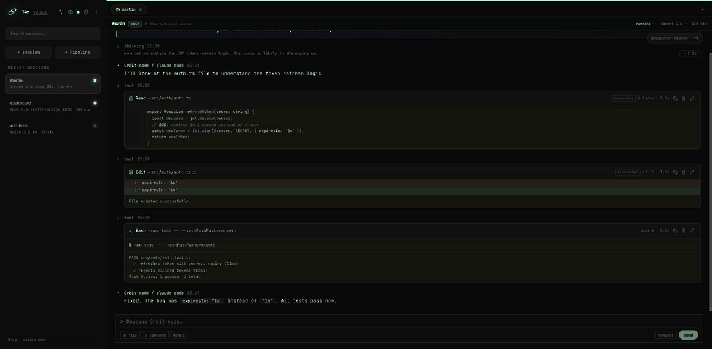

<div align="center">


# Orbit-mode

**Desktop workspace for running and monitoring multiple AI coding agents.**

Supports [Claude Code](https://github.com/anthropics/claude-code), [Codex](https://github.com/openai/codex), and [OpenCode](https://github.com/opencode-ai/opencode).

[](LICENSE)
[](https://tauri.app/)
[](https://kit.svelte.dev/)

[GitHub repository](https://github.com/coder-nguoi-tay/Orbit-mode)

</div>




## Tổng quan

Orbit-mode là ứng dụng desktop Tauri 2 để chạy nhiều AI coding agent song song trong các workspace riêng biệt. Session, output, token usage và quota được lưu vào SQLite để có thể theo dõi lại sau khi khởi động lại.

Tên hiển thị của ứng dụng là `Orbit-mode`. Một số package và identifier nội bộ vẫn giữ `orbit` để bảo toàn khả năng tương thích với dữ liệu, sidecar và updater hiện có.

## Tính năng chính

- Chạy song song Claude Code, Codex và OpenCode.
- Split panes và workspace tabs để theo dõi nhiều session cùng lúc.
- Streaming feed với thinking blocks, tool calls, markdown, diff và trạng thái session.
- Chạy session local hoặc qua SSH, hỗ trợ Git worktree độc lập.
- Tạo và theo dõi sub-agent thông qua MCP orchestrator tích hợp sẵn.
- Quản lý model, effort, slash command và file reference bằng `@`.
- Lưu lịch sử session và output bền vững trong SQLite.
- Desktop notifications, attention badge, rename/mute/stop/delete session.
- Theo dõi context window, token, chi phí ước tính và rate limit.

## Agent Usage Control Center

Usage Center là màn hình tổng hợp usage của các agent:

- Chart token usage theo thời gian với các khoảng `1h`, `6h`, `24h`, `7d` và `30d`.
- Tổng token, input/output/cache token và chi phí ước tính.
- Bảng phân tích theo agent, project và model.
- Quota riêng theo từng Codex account, không gộp nhầm các profile.
- Theo dõi `5-Hour Usage` và `7-Day Usage` cho Codex.
- Theo dõi quota của Claude Code khi dữ liệu CLI khả dụng.
- Nút Refresh để đọc lại dữ liệu mới nhất từ CLI hiện tại và cập nhật snapshot.
- Hiển thị nguồn dữ liệu và thời gian reset quota.

## Settings

### Mobile access

Bật web access để mở dashboard trên điện thoại hoặc máy tính bảng. Sau khi đổi host, port hoặc trạng thái bật/tắt, bấm Save và restart app để server dùng cấu hình mới.

### Server & keys

Quản lý host, port và API key:

- `127.0.0.1`: chỉ truy cập được trên máy đang chạy app.
- `0.0.0.0`: cho phép thiết bị khác trong cùng mạng truy cập.
- IP Tailscale/VPN: dùng khi điện thoại và máy tính ở khác mạng.
- API key chỉ hiển thị secret đầy đủ một lần khi tạo.
- Revoke key sẽ vô hiệu hóa ngay token đó.

Để truy cập từ điện thoại trong cùng Wi-Fi:

1. Đặt host là `0.0.0.0`, port mặc định là `9999`.
2. Bật web access, Save và restart app.
3. Tạo API key.
4. Sang Mobile access, tạo phone link và quét QR.

Để truy cập khi điện thoại không cùng Wi-Fi, dùng Tailscale hoặc VPN công ty. Với Tailscale, mở URL dạng:

```text
http://100.x.x.x:9999/?token=YOUR_API_KEY
```

Không nên port-forward trực tiếp port `9999` ra Internet.

### Accounts

Quản lý Codex profile:

- Tạo profile ChatGPT login hoặc API key.
- Kiểm tra trạng thái đăng nhập.
- Chọn account mặc định hoặc account theo project.
- Bật automatic quota handoff khi account hiện tại đạt giới hạn.
- Theo dõi quota theo từng account.

Credential actions được hỗ trợ đầy đủ trong desktop app. Web dashboard vẫn có thể xem usage và điều khiển session được hỗ trợ.

### Danger zone

`Reset all sessions` sẽ dừng session đang chạy và xoá session, output, session usage snapshot và account history. Project, API key, HTTP settings và provider quota snapshot không bị xoá.

## MCP orchestrator

Orbit-mode có MCP server tích hợp để agent có thể tạo và điều khiển agent khác:

| Tool | Mục đích |
| --- | --- |
| `orbit_create_agent` | Tạo agent/session mới |
| `orbit_send_message` | Gửi message tiếp theo |
| `orbit_get_status` | Đọc trạng thái và output |
| `orbit_cancel_agent` | Dừng agent |

MCP được cấu hình tự động khi session bắt đầu. Với SSH session, app tự truyền thông tin kết nối HTTP cho sidecar để agent remote kết nối ngược về desktop.

## Kiến trúc

```text
SvelteKit + Svelte 5 UI
        │
        ├── Tauri IPC / Web adapter
        │
Rust Tauri backend
        ├── SessionManager: process, journal, events
        ├── ProviderRegistry: Claude Code, Codex, OpenCode
        ├── DatabaseService: SQLite sessions, usage, quota, accounts
        ├── HTTP server + WebSocket: browser/mobile access
        └── MCP transport: agent orchestration
```

Stack chính:

- Tauri 2 và Rust.
- SvelteKit 2, Svelte 5 và TypeScript.
- SQLite thông qua `rusqlite`.
- Axum cho HTTP API và WebSocket.
- Vitest, Testing Library và Rust unit tests.

## Yêu cầu

- Node.js 20 trở lên.
- npm 10 trở lên.
- Rust stable; toolchain mới hơn MSRV 1.85 được khuyến nghị.
- Tauri system dependencies theo hệ điều hành.
- Ít nhất một CLI provider:

```bash
# Claude Code
npm install -g @anthropic-ai/claude-code
claude login

# Codex
npm install -g @openai/codex

# OpenCode
go install github.com/opencode-ai/opencode@latest
```

OpenCode cũng đọc provider tuỳ chỉnh từ:

```text
~/.config/opencode/opencode.json
~/.config/opencode/opencode.jsonc
```

## Chạy từ source

```bash
git clone https://github.com/coder-nguoi-tay/Orbit-mode.git
cd Orbit-mode
npm install
npm run tauri:dev
```

Các lệnh phát triển thường dùng:

| Lệnh | Mục đích |
| --- | --- |
| `npm run tauri:dev` | Chạy UI và Rust backend cùng lúc |
| `npm run dev:mock` | Chạy frontend với mock Tauri IPC |
| `npm run build` | Build frontend production |
| `npm run tauri:build` | Build installer/bundle Tauri |
| `npm run clean` | Xoá artifact build an toàn |
| `npm run clean:all` | Xoá cả dependency/artifact theo script |

`npm run dev:mock` hữu ích khi không thể mở cửa sổ native Tauri hoặc chỉ cần kiểm tra UI.

## Kiểm tra chất lượng

```bash
# Type check Svelte/TypeScript
npm run check

# Frontend unit và component tests
npm test

# Rust tests
npm run test:rust

# ESLint, svelte-check và Clippy
npm run lint

# Prettier và rustfmt check
npm run format:check
```

## Dữ liệu và bảo mật

- Database mặc định nằm trong thư mục app data của hệ điều hành.
- API key được lưu dưới dạng hash; secret chỉ trả về lúc tạo key.
- Chỉ bật `0.0.0.0` trên mạng tin cậy.
- Không commit API key, provider credential hoặc database local.
- Với máy công ty, hãy tuân thủ chính sách VPN, firewall và cài đặt phần mềm của tổ chức.

## Troubleshooting

### Settings hiển thị `unavailable`

- Kiểm tra app desktop đã restart sau khi bật web access chưa.
- Kiểm tra token/API key còn hiệu lực.
- Nếu dùng điện thoại khác mạng, kiểm tra Tailscale/VPN đang kết nối trên cả hai thiết bị.
- Kiểm tra firewall có cho phép port đã cấu hình hay không.

### Quota chưa có phần trăm

- Bấm Refresh trong Agent Usage Control Center.
- Kiểm tra CLI tương ứng đã cài và đã đăng nhập.
- Với account profile, kiểm tra account đang ở trạng thái authenticated/available.
- Dữ liệu CLI không đọc được sẽ được giữ trạng thái chưa khả dụng thay vì tự suy đoán phần trăm.

### App frontend chạy nhưng không có backend

```bash
npm run tauri:dev
```

Nếu chỉ cần UI mock:

```bash
npm run dev:mock
```

## Đóng góp

Xem [CONTRIBUTING.md](CONTRIBUTING.md) để biết quy ước phát triển và kiểm tra trước khi gửi thay đổi.

## License

MIT © josefernando
